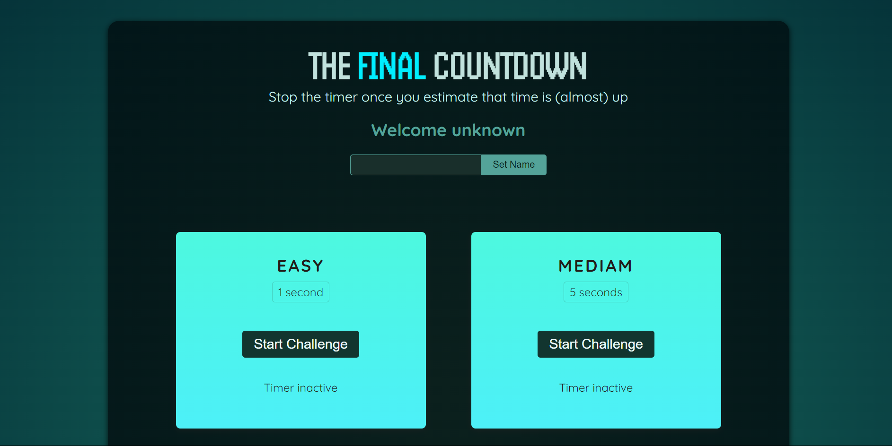
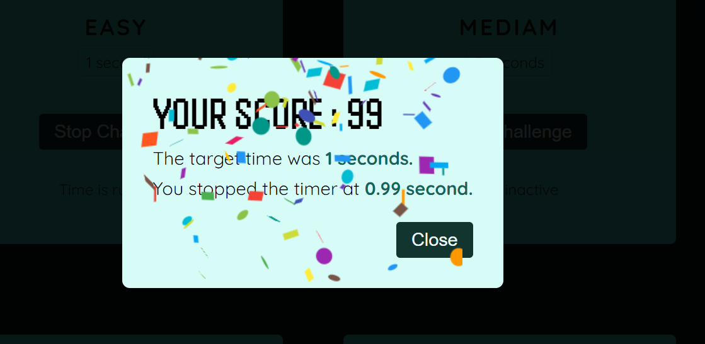

# Time Stopper ⌚

This is a simple game built using `React.js` where the objective is to stop the time as close as possible to a given target time. The closer the stopped time is to the target time, the higher the score.

## Features 🪶




- **React.js**: The game is built using React.js, a popular JavaScript library for building user interfaces.
- **useEffect Hook**: The useEffect hook is utilized to manage side effects, such as updating the game state based on user actions or timing events.
- **Dynamic Score Calculation**: Scores are dynamically calculated based on the difference between the stopped time and the target time.
- **Interactive Gameplay**: Users interact with the game by clicking on a button to stop the time.
- **Responsive Design**: The game is designed to be responsive and can adapt to different screen sizes and devices.

## Getting Started ⚙️

To run the game locally, follow these steps:

1. Clone this repository to your local machine.
   ```bash
   git clone https://github.com/TheValour/Countdown_Game.git
   ```
2. Navigate to the project directory.
   ```bash
   cd Countdown_Game
   ```
3. Install dependencies using npm or yarn.
   ```bash
   npm install
   # or
   yarn install
   ```
4. Start the development server.
   ```bash
   npm run dev
   ```
5. Open your browser and navigate to `http://localhost:3000` to play the game.

## Technology used
- React js
- react-confetti

## How to Play 

1. The game will display 4 different level select the level which you want.
2. The game will display a target time.
3. Click on the "Stop" button to stop the time.
4. The game will calculate your score based on how close the stopped time is to the target time.
5. Try to get the highest score possible by stopping the time as close to the target time as you can.


Enjoy the Game 😍 [Game Link](thevalour.github.io/Countdown_Game/)

## Contributors

> [The Valour](https://github.com/TheValour) - Developer 🧑‍💻

